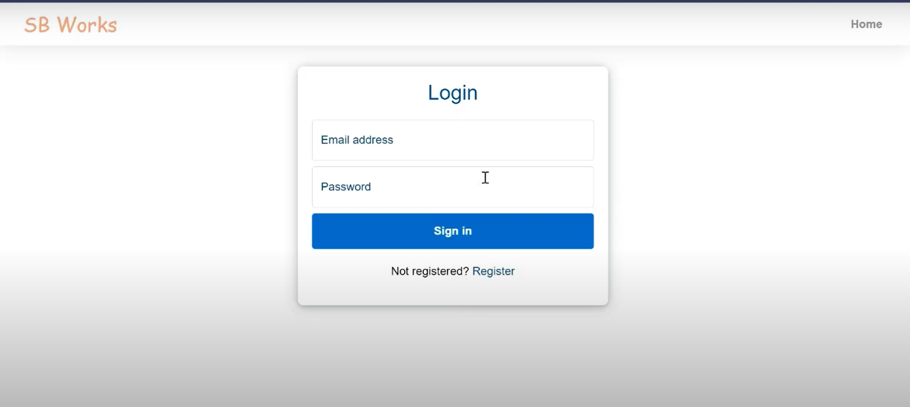
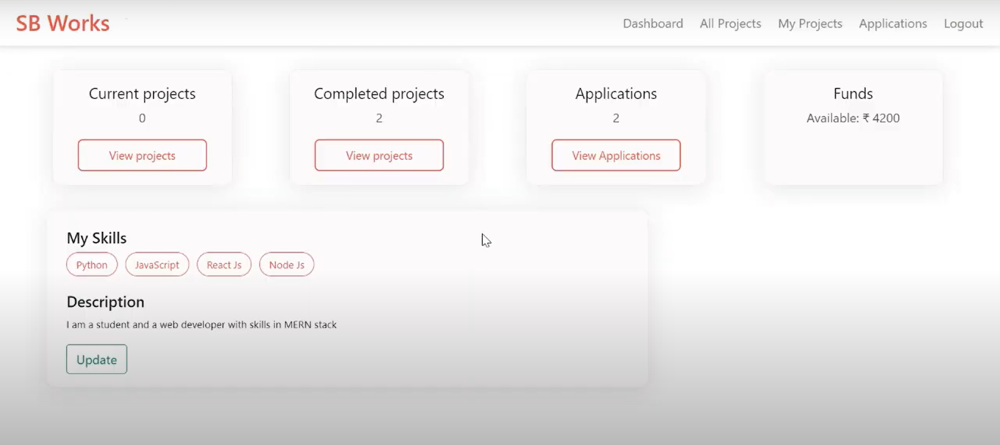
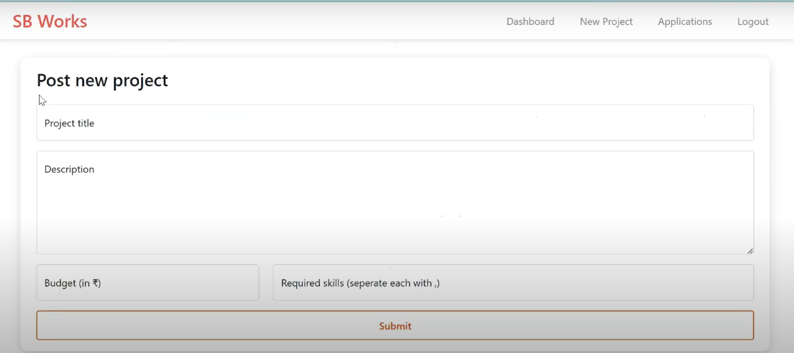
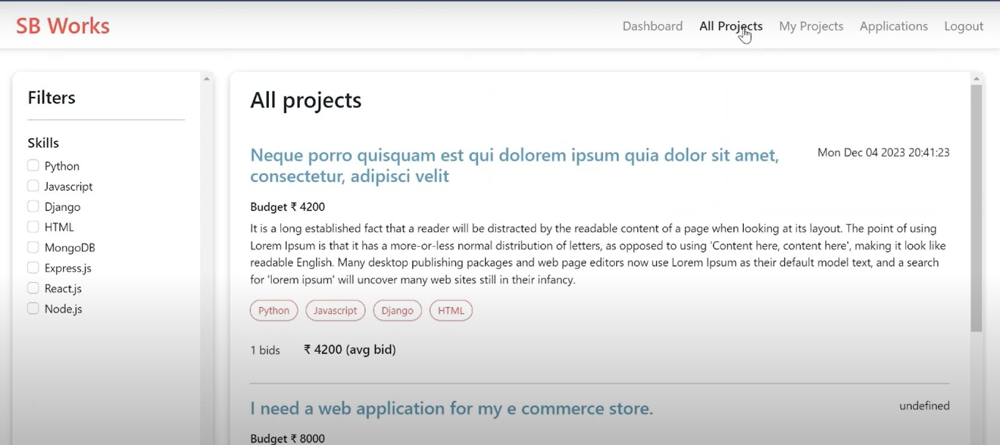
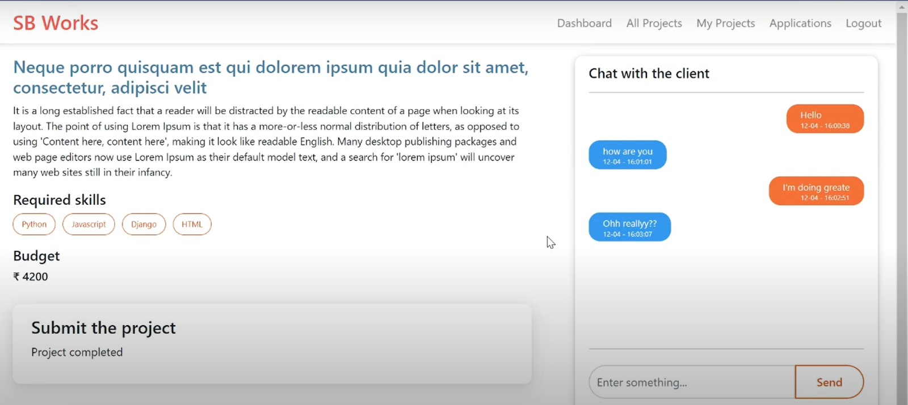
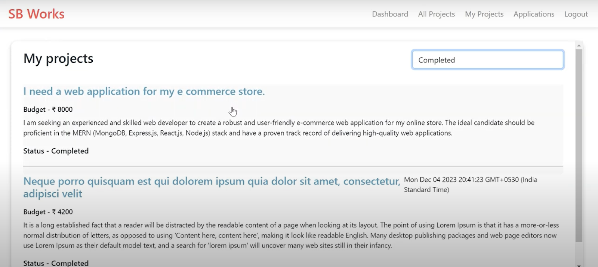
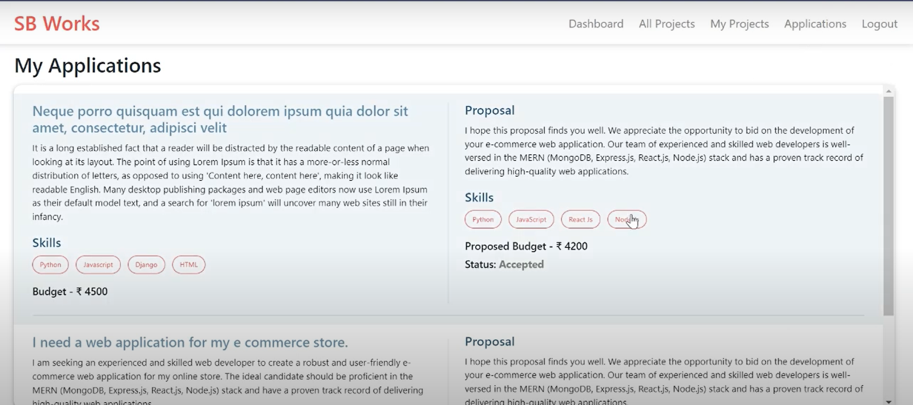

# Freelancing Job Portal

A robust **Freelancing Job Portal** application built using the MERN stack (**MongoDB, Express.js, React.js, Node.js**). This platform seamlessly connects freelancers and employers, allowing job listings, applications, and project management in an intuitive and secure environment.

## Features

- **User Authentication:** Secure login and registration for freelancers and employers using **JWT**.
- **Job Listings:** Employers can post job opportunities, and freelancers can browse and apply.
- **Project Management:** Track job applications and manage projects with ease.
- **Responsive Design:** Ensures smooth functionality across all device sizes.
- **Cloud Integration:** Image and file uploads are managed using **Cloudinary**.

## Technologies Used

- **Frontend:** React.js, React Router, Bootstrap
- **Backend:** Node.js, Express.js
- **Database:** MongoDB (Atlas for cloud hosting)
- **Authentication:** JSON Web Tokens (JWT) and Bcrypt for security
- **Deployment:** Vercel (frontend), Render (backend)

## Getting Started

### Prerequisites

1. Install **Node.js** (v22.2.0 or above recommended)
2. Set up a **MongoDB Atlas** account (or local MongoDB)
3. Create a **Cloudinary** account for image storage

### Installation

1. **Clone the repository**:
   ```bash
   git clone https://github.com/exclusiveabhi/react-job-portal.git
   cd react-job-portal
   ```

2. **Install dependencies**:
   ```bash
   # Backend
   cd backend
   npm install

   # Frontend
   cd ../frontend
   npm install
   ```

3. **Configure environment variables**:
   - Create a `config.env` file in the `backend/config` folder:
     ```
     PORT=<your-port>
     CLOUDINARY_API_KEY=<your-key>
     CLOUDINARY_API_SECRET=<your-secret>
     CLOUDINARY_CLOUD_NAME=<your-cloud-name>
     FRONTEND_URL=<your-frontend-url>
     DB_URL=<your-mongodb-url>
     JWT_SECRET_KEY=<your-secret-key>
     JWT_EXPIRE=<duration>
     COOKIE_EXPIRE=<duration>
     ```

4. **Run the application**:
   ```bash
   npm run dev
   ```

5. Open your browser and visit: `http://localhost:5173`

## Screenshots

Below are some screenshots showcasing the application:

### Login Page


### Dashboard


### Post New Project


### Application





## Contributions

We welcome contributions to enhance the functionality and features of the job portal. Feel free to fork the repository, make your changes, and submit pull requests.

## Contact

For feedback, suggestions, or queries, feel free to reach out through GitHub.
